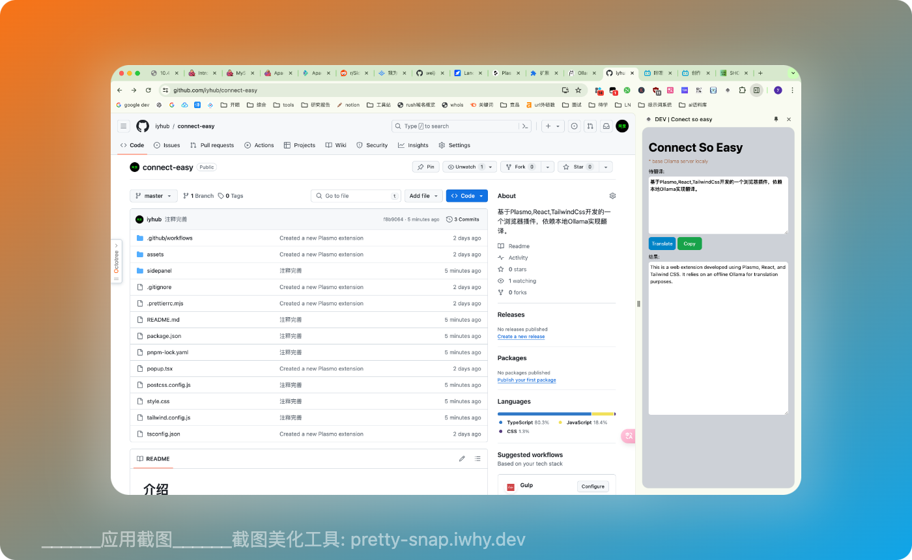

# 介绍 
基于Plasmo,React,TailwindCss开发的一个浏览器插件，依赖本地Ollama实现翻译



## 开始使用

0.请本地自行安装 Ollama

详见:https://www.ollama.com

0.1 下载大模型,我用的阿里的千问的大模型`qwen:7b`

```bash
ollama pull qwen:7b
```
0.2 启动ollama

0.2.1退出Ollama客户端
`启动Ollama服务`:
```yaml
# MacOS启动命令

 OLLAMA_ORIGINS=chrome-extension://* ollama serve
```

Win:未测试


1.安装相关依赖

```bash
pnpm install
# or
npm install
````

2.运行项目:
```bash
pnpm dev
# or
npm run dev
```

3.在 Chrome 中加载扩展程序(我知道的你会的)

4.二次开发
项目代码很简单,所有代码都在 [/sidepanel/index.tsx](sidepanel%2Findex.tsx)

